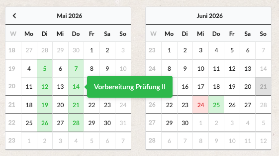

# Subway
Nothing more and nothing less than a private study  
for additional code for [WBCE][1].
***

### Requirements
- PHP >= 8.4.1
- [WBCE][1] >= 1.6.4
- Twig >= 3.14.x

#### Examples
- code2
```php
use Subway\core\Pages;
use Subway\core\tools\Data;

echo "PageTree - Neu mit »Subway«.";

$aPages  = Pages::getInstance()->getPageTree(
    0, // root
    ['page_id', 'page_title', 'menu_title']
);

echo Data::display($aPages);
```

- loading Subway-frontend css
```php
\Subway\core\Subway::getInstance()->initFrontend();
```

- e.g. test
```php
// css in frontend
\Subway\core\Subway::getInstance()->initFrontend();

echo "<p></p>";
$oTwig = Subway\core\template\TwigBox::getInstance();
$oTwig->registerPath(WB_PATH."/modules/Subway/templates/", "test");

echo $oTwig->render(
  "@test/testFormatWithMYSQL.lte",
  [
      'message' => "Test von Subway - Twig function »formatWithMYSQL«.",
      'theFormat' => "%W, %d. %M, %Y  - %H:%i",
      'theTime' => time(),
      'theLang' => 'fr_FR'
  ]
);
```
See  https://dev.mysql.com/doc/refman/8.4/en/date-and-time-functions.html#function_date-format

##### fomantic calendar

```php
/**
 * Fomantic Calendar
 *
 */
use Subway\core\Subway;
use Subway\core\css\FomanticCalendar;
use Subway\core\tools\Data;
use Subway\core\css\Fomantic;

Subway::getInstance()->initFrontend();

// Pre-initialize Formantic framework
Fomantic::getInstance();

$oCal = FomanticCalendar::getInstance();
$oCal->setDisplayMonths(3);

$oCal->addPeriod(
    '15.07.2026',
    '18.10.2026',
    ['Test Übungen 1', 'Prüfung A', 'Vorbereitung B'],
    '+2 week', // 'Monday next week'
    'orange',
    'orange' 
);

$oCal->addPeriod(
    '05.05.2026',
    '30.05.2026',
    ['Test Übungen 1', 'Test_Übung 2', 'Vorbereitung Test I', "Vorbereitung Prüfung II"],
    ['+2 day', '+5 day'],
    'green',
    'green' 
);

echo $oCal->generate();
```
Result:  
 

---
06.2026 Aldus

[1]: https://wbce.org/de/wbce/
[2]: https://forum.wbce.org/search.php?action=show_recent
