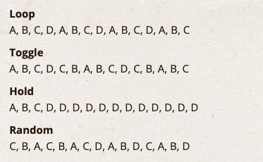

# ArrayStep
Iterates through array elements with various stepping modes.  
Supports LOOP, HOLD, TOGGLE, RANDOM, and STILL modes.

## Preface
Nothing more and nothing less than a private study  
for additional code for [WBCE][1].
***

### Requirements
- PHP >= 8.4.1
- [WBCE][1] >= 1.6.4
- Twig >= 3.14.x

##### Namespace
Subway\core  
e.g.  
```php
use Subway\core\ArrayStep;
$stepper = new ArrayStep( ['A', 'B', 'C', 'D'], ArrayStep::MODE_LOOP);
```

##### Supported values
Any contable items, also mixed ones.  
Like  
- int
- string
- array
- object

##### Notice
- NO empty array! At least one element as a minimum. Better min. three (for RANDOM)
- NO mixed initial mode flags: e.g. 
```
ArrayStep::MODE_LOOP|ArrayStep::MODE_RANDOM|ArrayStep::MODE_HOLD
```

##### Supported Constants
| const | value |  
| :-------- | :----- |
| ArrayStep::MODE\_STILL | 0 |
| ArrayStep::MODE\_LOOP | 1 |
| ArrayStep::MODE\_HOLD | 2 |
| ArrayStep::MODE\_TOGGLE | 4 |
| ArrayStep::MODE\_RANDOM | 8 |

#### Example/Usage
```php
$colors = ['red', 'green', 'blue', 'yellow'];
$stepper = new ArrayStep($colors, ArrayStep::MODE_LOOP);

// Basic usage
echo $stepper->getAndStep();  // 'red'
echo $stepper->getAndStep();  // 'green'
echo $stepper->getAndStep();  // 'blue'
echo $stepper->getAndStep();  // 'yellow'
echo $stepper->getAndStep();  // 'red' (loops)

// Iterator interface
foreach ($stepper as $color) {
    echo $color . "\n";
}

// Reset and reposition
$stepper->reset();
$stepper->setPosition(2);
echo $stepper->get();  // 'blue'

// Safe mode switching
if ($stepper->setMode(ArrayStep::MODE_RANDOM)) {
    echo $stepper->getAndStep();  // Random element
}
```
#### Quick test inside code2 section ...

```php
use Subway\core\Subway;
use Subway\core\ArrayStep;
use Subway\core\tools\Data;

Subway::getInstance()->initFrontend();

$iMax = 15;
$myArray = ["A", "B", "C", "D"];

$modes = [
    'Loop'      => ArrayStep::MODE_LOOP,
    'Toggle'    => ArrayStep::MODE_TOGGLE,
    'Hold'      => ArrayStep::MODE_HOLD,
    'Random'    => ArrayStep::MODE_RANDOM
];

foreach ($modes as $name => $currendMode)
{
    $oARRAY_STEP = new ArrayStep($myArray, $currendMode);
    $result = [];
    for ($i=0; $i < $iMax; $i++)
    {
	    $result[] = $oARRAY_STEP->getAndStep();
    }

    echo "<p><strong>" . $name . "</strong><br>".implode(", ", $result) . "</p>";
}
```
Output should be similar like:  
 

---
08.2026 Aldus

[1]: https://wbce.org/de/wbce/
[2]: https://forum.wbce.org/search.php?action=show_recent
