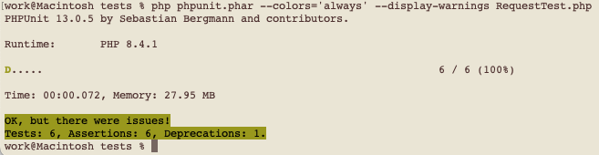

### Why this?
Some remarks (unsorted at this time).

#### Why is no phpunit(.phar) in this project?
Because i've got no idea about how and where anyone as his phpunit  
installed; nor what IDE is used.

I for myself prefert to handle phpunit tests via terminal/console.

To get phpunit use you can use (e.g.)
```php
wget -O phpunit https://phar.phpunit.de/phpunit-13.phar
```

You can find [PhpUnit][1] here: https://phpunit.de/index.html

#### How to use it
Example given
```php
cd ~/projekte/wbce_git/wbce/modules/Subway/tests
php phpunit.phar --colors='always' --display-warnings RequestTest.php
```

To use a spezific php version, e.g. under MacOS e.g. MAMP you will have to export like
```php
export PATH=/Applications/MAMP/bin/php/php8.4.1/bin:$PATH
```

### misfortune?

Here is one [](img/unfortunately_01.png)

March 2026

[1]: https://phpunit.de/index.html
